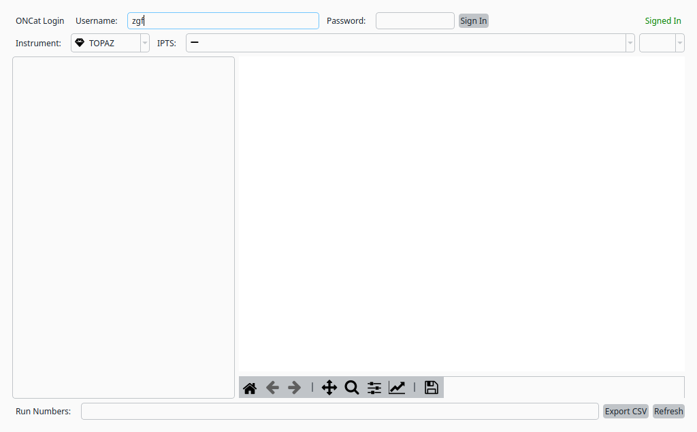
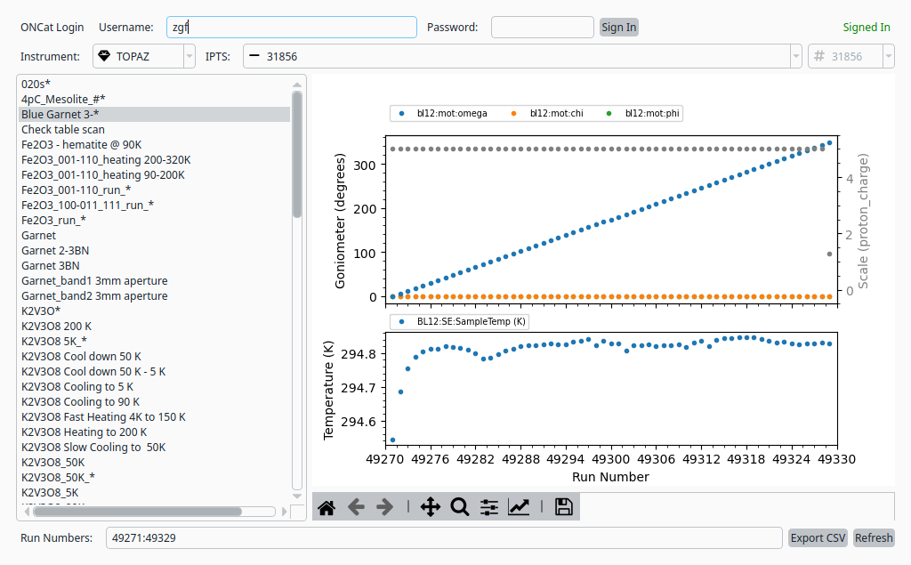

Experiment Browser for TOPAZ
=============================

This tutorial demonstrates how to use the *garnet* experiment browser
to navigate IPTS data for the TOPAZ instrument.

Step 1: Launch the Experiment Browser
--------------------------------------
- The experiment browser can be launched from within *NeuXtalViz* or as a
  standalone utility.
- It connects to the ONCat data archive to list available experiments.

Step 2: Connect to Data Archive
-------------------------------
- Ensure you have an active internet connection to access the ONCat archive.
- Enter your credentials if prompted to authenticate with the data archive.
- Once connected, the browser will display a list of available instruments.

Step 3: Select Instrument
--------------------------
- Choose **TOPAZ** from the instrument drop-down menu.
- The browser will populate with available IPTS experiments.

   Experiment browser with TOPAZ instrument selected.

Step 4: Navigate Experiments
------------------------------
- Browse available IPTS numbers and run ranges.
- Select **IPTS-31856** from the IPTS drop-down to load its data files.
- The run list and goniometer plot will populate automatically.
- Use the browser to locate run numbers for loading into the
  reduction pipeline.

   Experiment browser with IPTS-31856 loaded.
