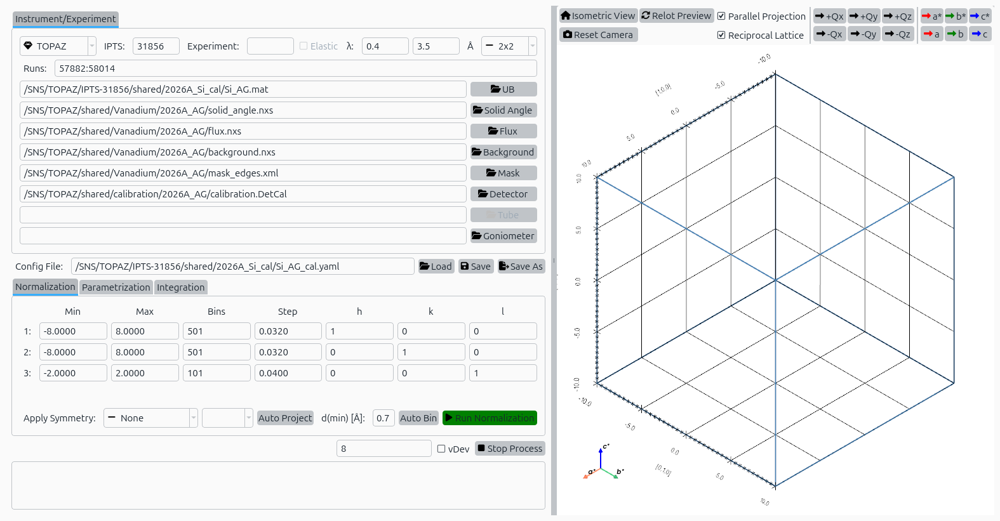
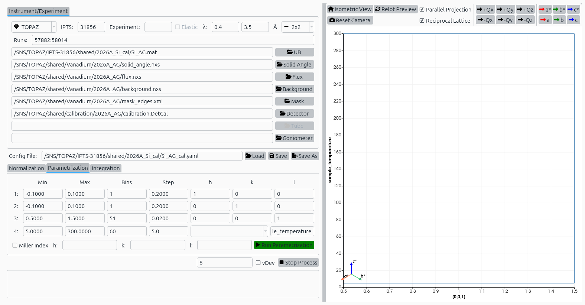
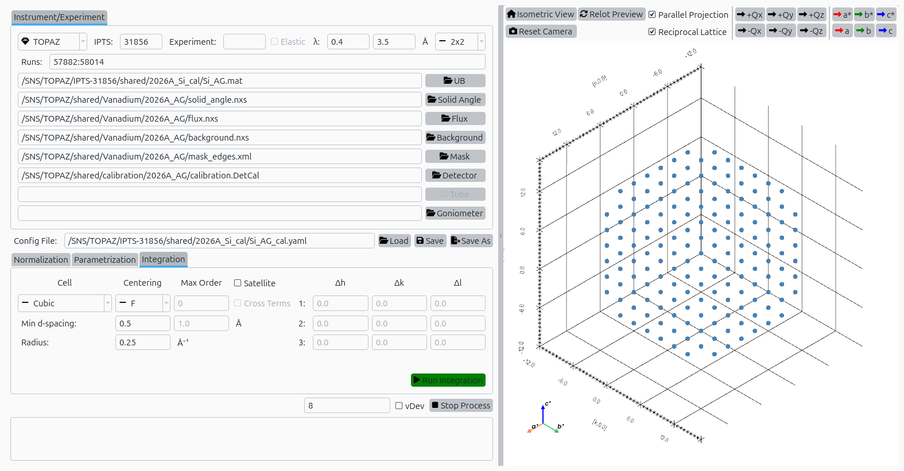

Reduction Plan with Silicon Data
=================================

This tutorial demonstrates how to use *garnet* to set up a complete
data reduction plan for TOPAZ silicon calibration data
(chemical formula :math:`\mathrm{Si}`).

Step 1: Load Configuration
---------------------------
- Launch the garnet application.
- Use **File → Load Config** to open a YAML reduction plan.
- Select the plan file ``Si_AG_cal.yaml``.
- The reduction parameters will populate all three tabs.

Step 2: Normalization
---------------------
- Switch to the **Normalization** tab.
- Review the normalization parameters including vanadium runs,
  background runs, and flux correction settings.
- Click **Run** to execute the normalization step.

   Normalization tab with Silicon configuration loaded.

Step 3: Parametrization
------------------------
- Switch to the **Parametrization** tab.
- Review peak shape parameters for the instrument geometry.
- Click **Run** to fit peak profiles and determine parametrization.

   Parametrization tab with Silicon configuration loaded.

Step 4: Integration
--------------------
- Switch to the **Integration** tab.
- Review the ellipsoidal integration parameters including
  peak radius, background shell, and projection settings.
- Click **Run** to perform peak integration.

   Integration tab with Silicon configuration loaded.
